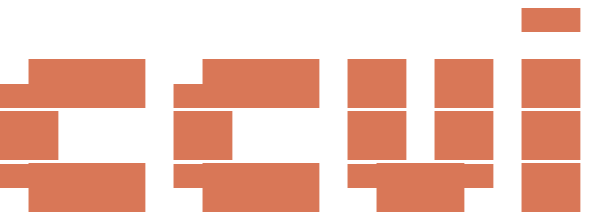

<p align="center">
  
</p>

# ccui

TUI for browsing and managing Claude Code sessions, plans, notes, skills, and rules.

## Install

```bash
pip install -e .
```

## Usage

```bash
ccui
```

## Views

`Tab` switches between two views:

### Timeline View (default)

All sessions across projects, sorted by most recent.

### Project View

Left: project list. Right: 6 tabs — Sessions, Plans, Notes, Skills, Rules, Config.

Switch tabs with `h`/`l` or `1`–`6`.

## Keybindings

### Global

| Key | Action |
|-----|--------|
| `Tab` | Switch Timeline ↔ Project view |
| `/` | Search / filter |
| `T` | Cycle theme |
| `R` | Reload all data |
| `q` | Quit |
| `Esc` | Back / close search |

### Navigation (Vim-style)

| Key | Action |
|-----|--------|
| `j` / `k` or `↑` / `↓` | Move cursor up/down |
| `g` / `G` | Jump to top / bottom |
| `h` / `l` | Previous / next tab (Project view) |
| `1`–`6` | Jump to tab by number (Project view) |

### Actions

| Key | Action | Applies to |
|-----|--------|------------|
| `Enter` | View detail | Sessions, Plans, Notes, Skills, Rules |
| `o` | Resume session in Claude Code | Sessions |
| `d` | Delete with confirmation | Sessions, Plans, Notes |
| `a` | Toggle archive | Sessions |
| `H` | Toggle show/hide archived | Sessions |
| `r` | Rename | Plans, Notes |
| `n` | Create new (opens `$EDITOR`) | Plans, Notes |
| `e` | Edit in `$EDITOR` | Plans, Notes, Skills, Rules, CLAUDE.md |
| `x` | Export session as plan or note | Sessions |

### Content Viewer

| Key | Action |
|-----|--------|
| `j` / `k` | Scroll down / up |
| `h` / `l` | Scroll left / right |
| `g` / `G` | Jump to top / bottom |
| `x` | Export to plan/note |
| `o` | Resume session |
| `Esc` / `q` | Back |

## Features

### Session Management

- Browse all Claude Code sessions across projects
- Display session name from CC's `/rename` (customTitle), fallback to session ID
- Inline preview: summary + first few messages
- Resume sessions directly (`o` → runs `claude --resume` with correct project cwd)
- Archive sessions (`a` to toggle, `H` to show/hide)
- Export conversations as plans or notes
- Delete sessions with confirmation

### Session Summaries

Use the `/ccui-summary` skill inside Claude Code to generate a short name and one-line summary for the current session. The skill:

1. Generates a 1–2 word name and sets it via `/rename`
2. Saves a one-line summary to `~/.claude/ccui-summaries.json`

Summaries appear in the preview area with a `▸` prefix and are included in search.

### Plans & Notes

Stored in `{project}/.claude/plans/*.md` and `{project}/.claude/notes/*.md` with YAML frontmatter. Create, view, edit, rename, delete, and link to sessions.

### Skills & Rules

Browse and edit skills (`.claude/skills/`) and rules (`.claude/rules/`), both project-level and global (`~/.claude/`).

### Project Config

Read-only overview of CLAUDE.md, Auto Memory, and settings.local.json. Press `e` to edit CLAUDE.md.

### Themes

Cycle through 10 themes with `T` (persisted across sessions):

Light: quiet-light (default), textual-light, catppuccin-latte, solarized-light
Dark: textual-dark, nord, dracula, tokyo-night, gruvbox, catppuccin-mocha

### Search

Press `/` to filter across session titles, summaries, project names, and git branches.
